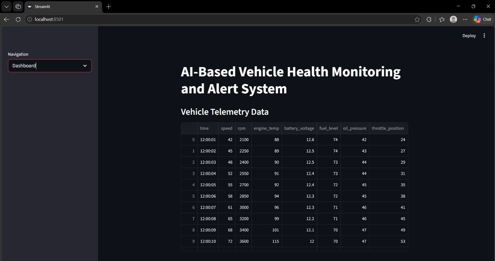
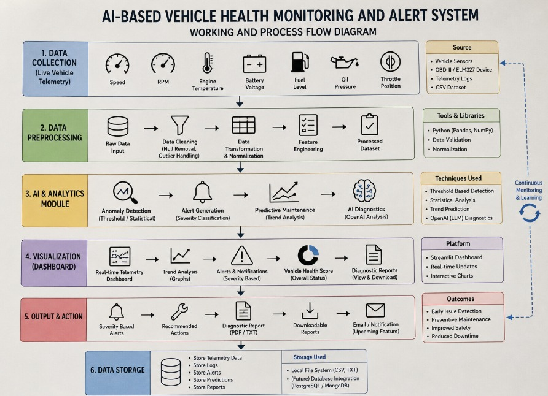

# AI-Based Vehicle Health Monitoring and Alert System

An AI-powered intelligent vehicle monitoring dashboard developed using Python, Streamlit, and OpenAI APIs for real-time telemetry analysis, anomaly detection, predictive maintenance, and automated diagnostics.

---

## Features

- Real-time vehicle telemetry monitoring
- AI-generated vehicle diagnostics
- Severity-based anomaly detection
- Predictive maintenance insights
- Vehicle health score evaluation
- Interactive Streamlit dashboard
- Telemetry trend visualization
- Downloadable diagnostic reports

---

## Technologies Used

- Python
- Streamlit
- Pandas
- OpenAI API
- CSV Telemetry Dataset

---

## Vehicle Parameters Monitored

- Speed
- RPM
- Engine Temperature
- Battery Voltage
- Fuel Level
- Oil Pressure
- Throttle Position

---

## Project Modules

1. Telemetry Data Monitoring
2. Anomaly Detection System
3. Predictive Maintenance Analysis
4. AI Diagnostic Engine
5. Vehicle Health Scoring
6. Dashboard Visualization
7. Diagnostic Report Generation

---

## Future Improvements

- Real ECU integration
- IoT sensor connectivity
- Cloud deployment
- Machine learning-based anomaly prediction
- Fleet management integration

---

## Screenshots

### Dashboard Interface

### AI Diagnostic Analysis

### System Architecture

---

## Author

Ayush Pathania
